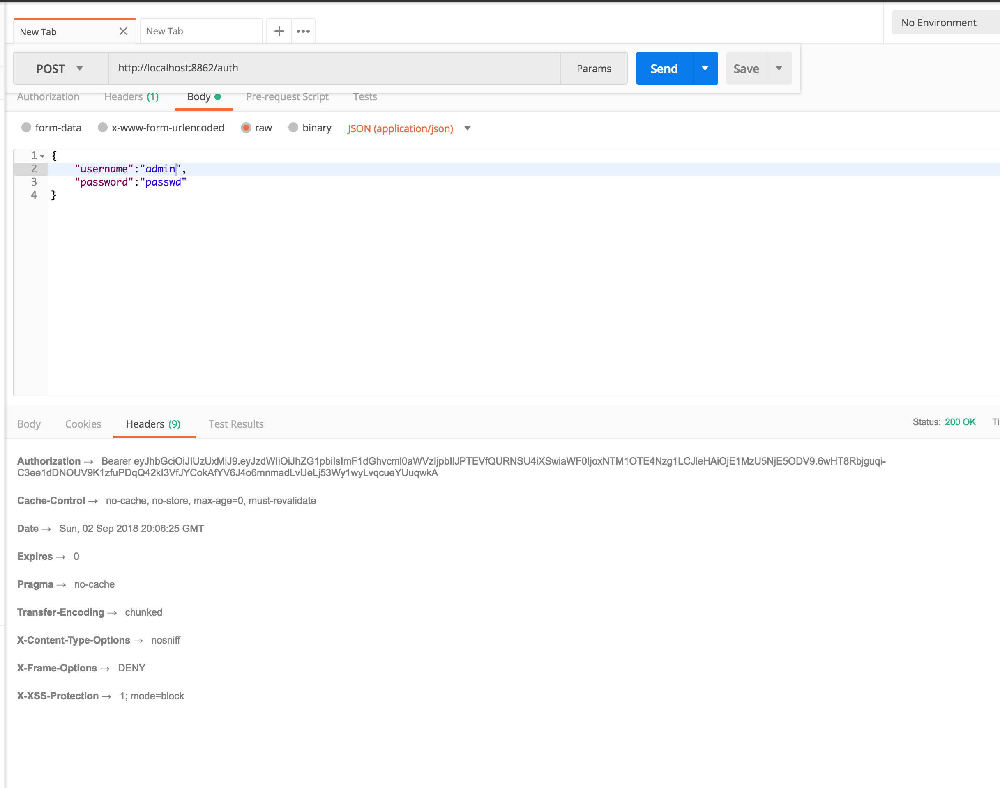
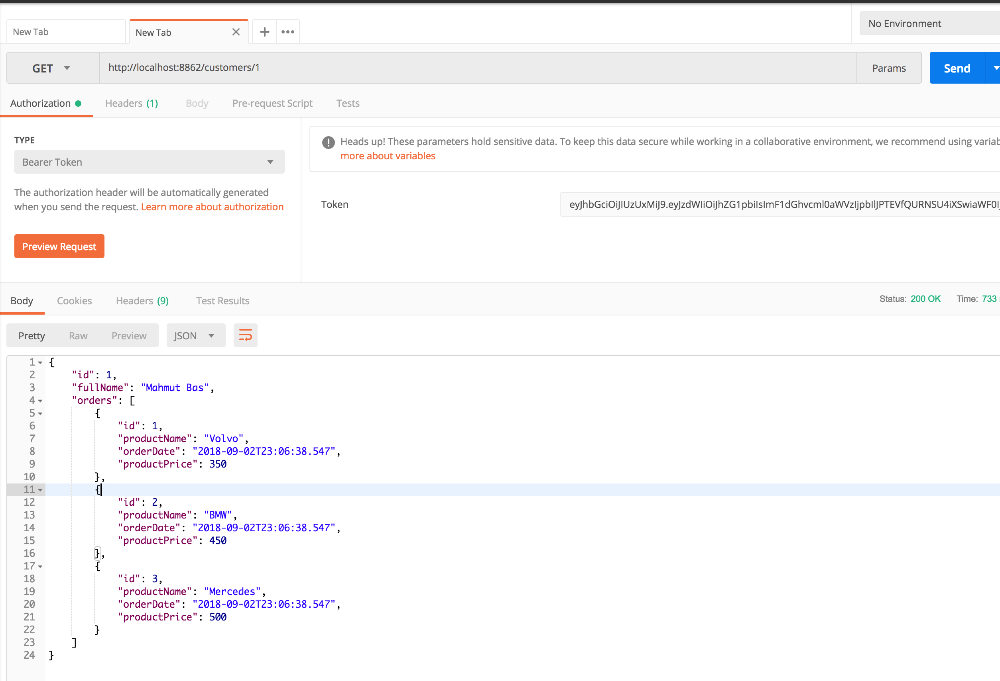

# Microservices with Netflix Magic

Published application modules;

* **eureka-server** : replicated 2 instances eureka discoverer
* **config-service** : generic configurations for all microservices
* **client-order-service** : simple microservices for client access. It includes sleuth.
* **client-customer-service** : simple microservices for client access. Also it calls order-service using restTemplate. In addition, it includes hystrix and sleuth.
* **auth-service** : Jwt token generator and validator
* **zuul-server** : Gateway for unknown clients. Also it is authorization gate.

#### Eureka Server
It’s the naming server, or called service registry. It’s duty to give names to each microservice. Why?

* No need to hardcode the IP addresses of microservices.
* What if services use dynamic IP addresses; when autoscaling.

So, every service registers itself with  Eureka (**@EnableEurekaClient**), and pings Eureka server to notify that it’s alive.

dependencies: Web, Eureka Server, and DevTools (optional).

#### Ribbon
We can have load balancer with @LoadBalanced. If we use this annotation on restTemplate consctructor, we can get available instances from eureka.

#### Zuul - Gateway

A gateway is a single entry point into the system, used to handle requests by routing them to the corresponding service. It can also be used for authentication, monitoring, and more.

We can call services from browser altough instances running at different ports.

* Maps between a prefix path, say/customers/** and a service customer-service. It uses Eureka server to route the requested service.
* It uses Eureka server to route the requested service.
* It load balances (using Ribbon) between instances of a service running on different ports.
* We can filter requests, add authentication, etc.

dependencies: Web, Eureka Client, and Zuul

#### Hystrix

Hystrix is the implementation of Circuit Breaker pattern, which gives a control over latency and failure between distributed services. Spring looks for any method annotated with the @HystrixCommandannotation, and wraps that method so that Hystrix can monitor it.

Hystrix watches for failures in that method, and if failures reached a threshold (limit), Hystrix opens the circuit so that subsequent calls will automatically fail. Therefore, and while the circuit is open, Hystrix redirects calls to the fallback method

#### Sleuth

Sleuth makes it possible to trace the requests by adding unique ids to logs. A trace id (1st) is used for tracking across the microservices; represents the whole journey of a request across all the microservices, while span id (2nd) is used for tracking within the individual microservice.

Finally getting token and calling service from gateway:

Thanks to Omar El Gabry for [my referance document](https://medium.com/omarelgabrys-blog/microservices-with-spring-boot-intro-to-microservices-part-1-c0d24cd422c3).

